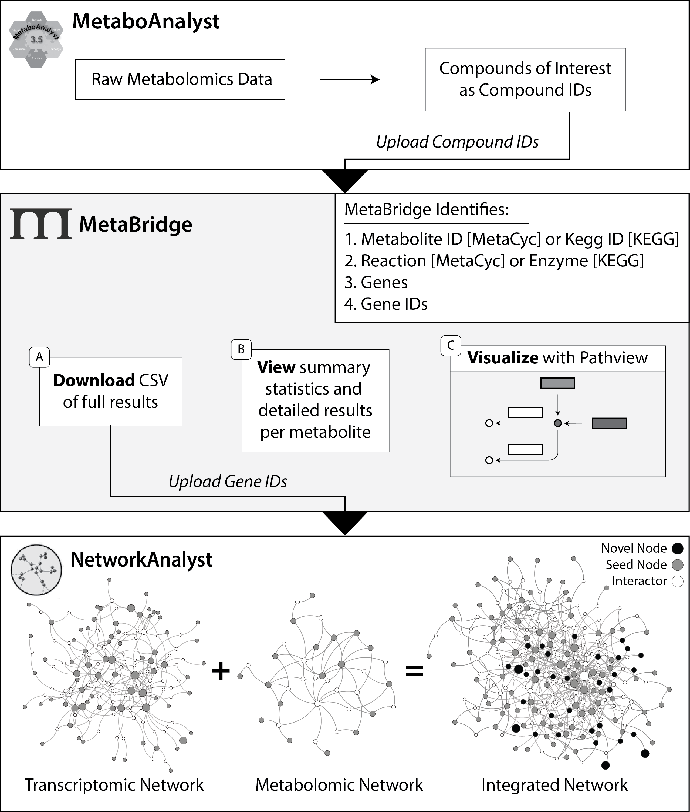

# MetaBridge 2.0

Hosted at [metabridge.samhinshaw.com](https://metabridge.samhinshaw.com/)

> ([metabridge.org/dev](https://metabridge.org/dev) will redirect you)

## Description

MetaBridge is a data integration system for integration of metabolomics data with other omics types, chiefly transcriptomics and proteomics.

MetaBridge 2.0 is a ground-up rewrite of MetaBridge! Written in React, with Node.js and Next.js, MetaBridge 2.0 will be faster, more stable, and have more features than the original MetaBridge!

## Contents

## Usage

MetaBridge is designed to facilitate integrative analysis by identifying the enzymes that directly interact with metabolites of interest. A pipeline may be designed as such:

### Tutorial

To learn how to use MetaBridge as part of a network-based integrative analysis workflow, please read our [tutorial](./tutorial/tutorial.md).
